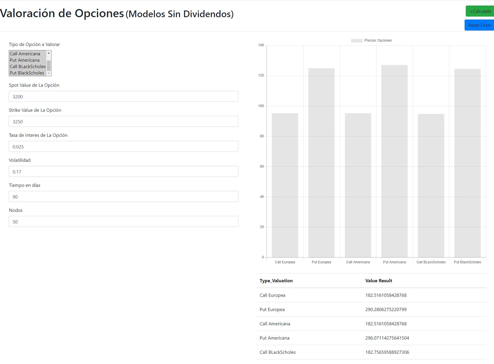

# This is a website for Option Valuation

## Random Tree valuation of options 

This has different methodologies and multiselect of the option valuation in order to compare prices and according to that decide which is the best position to take if put or call in European or American type

You can take a look of the deployed app in the following [link](https://triviacomidacolombiana.ue.r.appspot.com/)

This is being deployed using [Google Cloud](https://cloud.google.com/appengine/docs/flexible/python/runtime), this is App Engine tool that help you automate the flow of you web aplications,

You Could Select Several types of Valuation at the same time,

In the example the Valuation is done in COP(Colombian Pesos) but it will work with different type of currencies since is based on general model( [Binomial Option Valuation](https://www.investopedia.com/terms/b/binomialoptionpricing.asp)) and iterative and Stochastic models like BackSholes Valuation.

Binary option Valution has a similar behavior as a tree in which per node it gets recalculated the value of the option based on the previous node
  